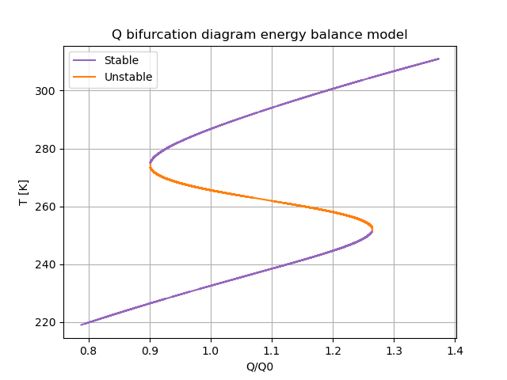
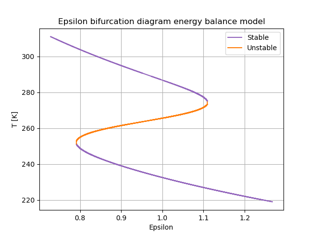

# Energy balance model
This is a Python implementation of the energy balance model as derived in the lectures. The model is given by the following differential equation:

$$ c \frac{dT}{dt} = Q(1-\alpha) - \varepsilon \sigma T^4$$

First the base scenario is plotted to display that we can have multiple equilibria for different Q and epsilon. This results in the following plot:

After this the bifucation diagrams for Q and epsilon are plotted. To find the equilibria. the [Scipy Brentq](https://docs.scipy.org/doc/scipy/reference/generated/scipy.optimize.brentq.html) package has been used. This package finds the roots on a given interval, this is important, since otherwise we only find a single root. To determine the stability of the solution, the derivative is computed using central differences. If the derivative is greater than 0, the solution is unstable. Else the solution is stable. For Q, we get the following bifurcation diagram:

And following a simular procedure, we get the following bifurcation diagram for epsilon:

