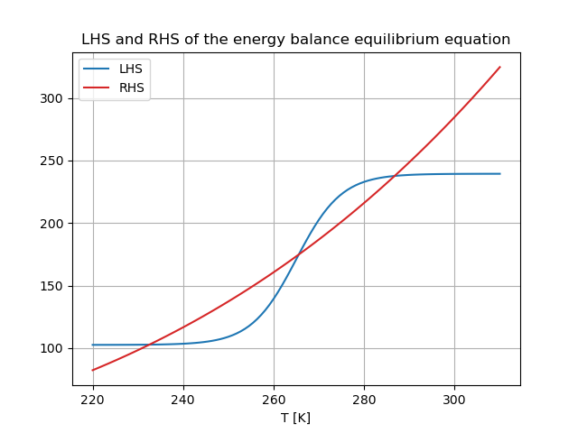

# Energy balance model
This is a Python implementation of the very simple energy balance model as derived in the lectures. First the base scenario is plotted to display that we can have multiple equilibria for different Q and epsilon. This results in the following plot:

