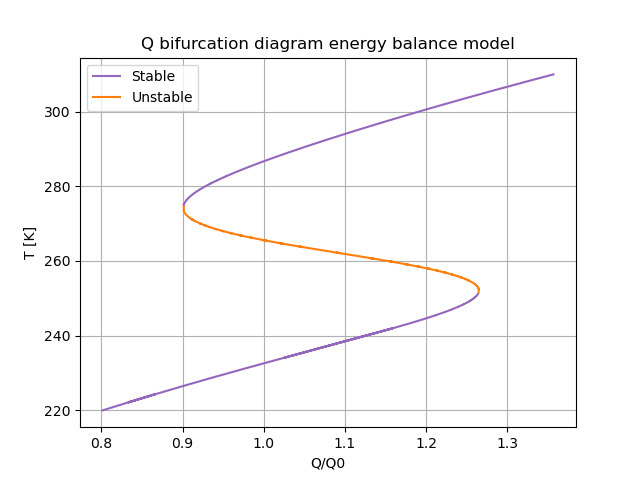
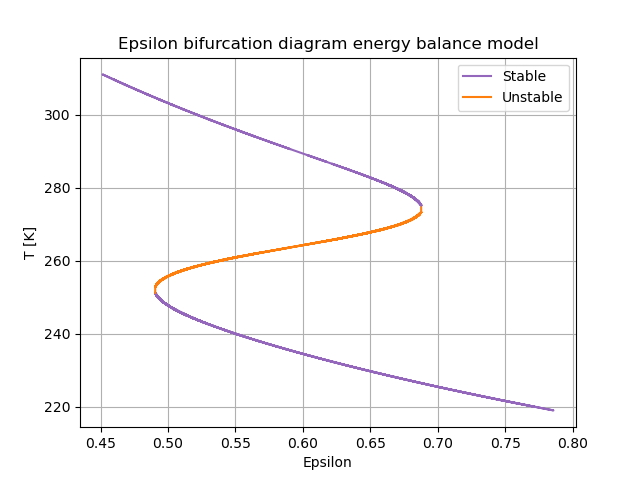

# Energy balance model
This is a Python implementation of the very simple energy balance model as derived in the lectures. First the base scenario is plotted to display that we can have multiple equilibria for different Q and epsilon. This results in the following plot:

After this the bifucation diagrams for Q and epsilon are plotted. To find the equilibria. the [Scipy Brentq](https://docs.scipy.org/doc/scipy/reference/generated/scipy.optimize.brentq.html) package has been used. For Q, we get the following:

And for epsilon:

