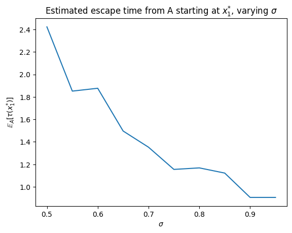

In this notebook trajectories of the box model perturbed by a stochastic term are evaluated. 

The dimensionless Stommel box model can be described by the following ODE:
$$ \dot{x} = \lambda - |1-x|x := f(x) $$

By introducing stochastiscity, the variable $x(t)$ will be transformed into a stochastic process $X(t)$, and realizations of $X(t)$ will be considerd. 

The stochastic Stommel box model can be described by the following SDE:

$$dX = f(X)dt + \sigma dW$$

where $\sigma$ is some parameter controlling the strength of the stochastic term.

To compute realizations of $X(t)$, the Euler–Maruyama (EM) method was used.  

The following plots show realizations of $X(t)$ for various values of $\sigma$

Subsequently, the escape time $\mathbb{E}_{A}[\tau(x)]$ from the set $ A =[x^{*}_{2}, \infty)$ starting at $x = x^{*}_{1}$ was estimated, for various values of $\sigma$. 

This estimation will be done by taking a sample of realizations of $X(t)$ for which the escape time will be computed, and then the sample average will be taken. It is expected that the escape time decreases as $\sigma$ increases. This is because as $\sigma$ increases, for any fixed time $t_{0}$ there is a larger proportion of realizations which escape $A$ within the domain $[0,t_{0}]$. 

From the experiment the following plot was produced

where we indeed observe a decreasing estimate of the escape time as $\sigma$ increases.